  

 

 
  

    
    
  

 

---

## 📌 About Me

I am an **Electronics and Communication Engineering** student passionate about software engineering, embedded systems, and artificial intelligence. My core expertise sits at the intersection of **hardware-software co-design**, **IoT telemetry**, and **vision AI systems**.

From engineering firmware on microcontrollers (ESP32/STM32) streaming industrial Modbus telemetry over MQTT, to developing intelligent vision algorithms that index and query CCTV video using natural language, I build efficient, real-world solutions across the full technology stack.

- ⚙️ **Core Focus:** Java Backend Architecture, System Design, Data Structures & Algorithms, Embedded C/C++
- 🛰️ **IoT & Edge:** Real-time Telemetry, Industrial Protocols (Modbus RS485, MQTT), Microcontrollers
- 🧠 **AI & Vision:** Multimodal Video Search (YOLO, CLIP, DINO), OpenCV, Edge AI Integration
- 🎯 **Current Objective:** Open to **Software Engineering Internships / Full-Time Roles** and collaborative **Embedded AI / System Design** projects.

---

## 🛠️ Tech Stack & Capabilities
 
<table>
  <tr>
    <td width="22%" valign="top"><b>Languages & Core</b></td>
    <td>
      
      
      
      
      
    </td>
  </tr>
  <tr>
    <td width="22%" valign="top"><b>Embedded & IoT</b></td>
    <td>
      
      
      
      
      
      
    </td>
  </tr>
  <tr>
    <td width="22%" valign="top"><b>Web & Systems</b></td>
    <td>
      
      
      
      
    </td>
  </tr>
  <tr>
    <td width="22%" valign="top"><b>AI & Computer Vision</b></td>
    <td>
      
      
    </td>
  </tr>
  <tr>
    <td width="22%" valign="top"><b>Tools & Environment</b></td>
    <td>
      
      
      
      
    </td>
  </tr>
</table>

---

## 🚀 Featured Projects

<table>
  <tr>
    <td width="100%" valign="top">
      <h3>🔍 Natural Language CCTV Search</h3>
      
An AI surveillance system that lets you search CCTV footage using plain English instead of scrubbing through hours of video — combines object detection with vision-language models to make surveillance footage indexed and searchable.

      
<b>Tech Stack:</b> Python • YOLO • CLIP • DINO • OpenCV

      <a href="https://github.com/Shreevishnu-senthilkumar/CCTV-Ai-Vision-Search"><b>View Repository »</b></a>
    </td>
  </tr>
  <tr>
    <td width="100%" valign="top">
      <h3>⚡ Industrial Energy Monitoring System</h3>
      
Real-time energy monitoring for industrial equipment, pulling live data from field devices over RS485/Modbus and streaming it via MQTT — built to catch inefficiencies before they show up on the power bill.

      
<b>Tech Stack:</b> ESP32 • MQTT • RS485 • Modbus • Embedded C++

      <a href="https://github.com/Shreevishnu-senthilkumar/EnergyMeter-Powerhouse"><b>View Repository »</b></a>
    </td>
  </tr>
  <tr>
    <td width="100%" valign="top">
      <h3>🏫 Smart Classroom Automation</h3>
      
Sensor-driven automation for lighting, fans, and occupancy in classrooms, aimed at cutting energy waste in spaces that are rarely fully occupied.

      
<b>Tech Stack:</b> ESP32 • Sensors • Arduino • C++

      <a href="https://github.com/Shreevishnu-senthilkumar/Power-Automation"><b>View Repository »</b></a>
    </td>
  </tr>
</table>

---

## 📊 GitHub Analytics

  

 

---

## 🐍 Monster Contribution Snake

<picture>
  <source
    media="(prefers-color-scheme: dark)"
    srcset="https://raw.githubusercontent.com/Shreevishnu-senthilkumar/Shreevishnu-senthilkumar/output/github-contribution-monster-dark.svg">

  <source
    media="(prefers-color-scheme: light)"
    srcset="https://raw.githubusercontent.com/Shreevishnu-senthilkumar/Shreevishnu-senthilkumar/output/github-contribution-monster.svg">

  
</picture>

